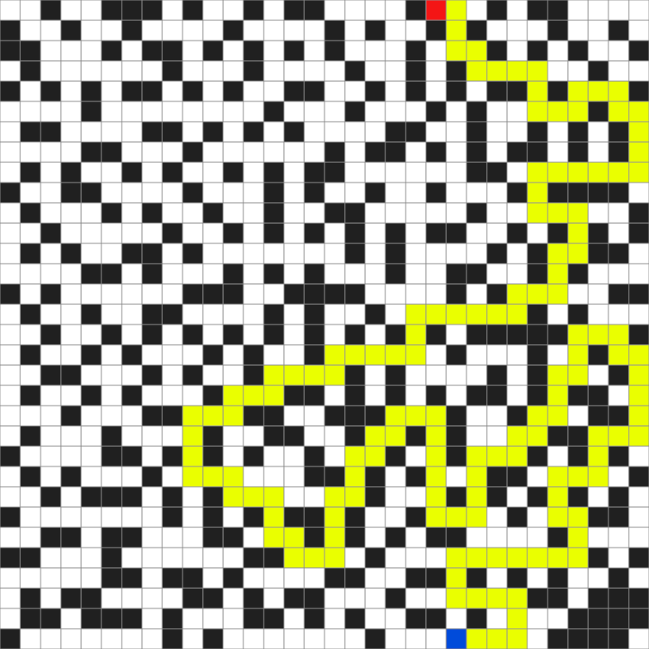
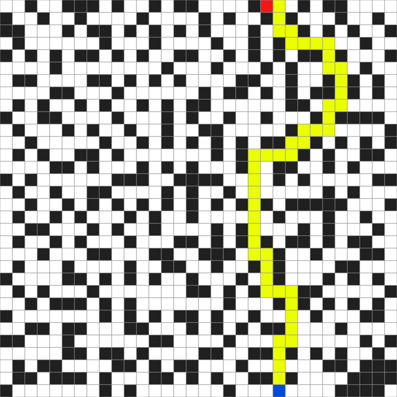
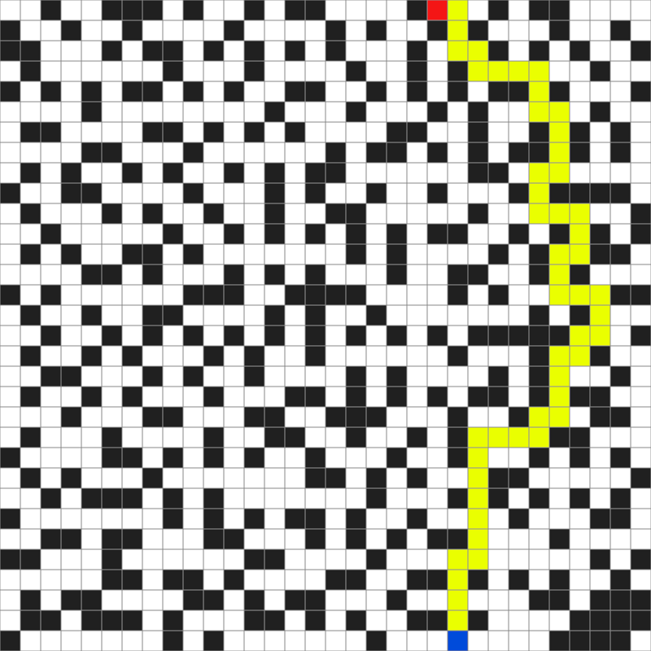
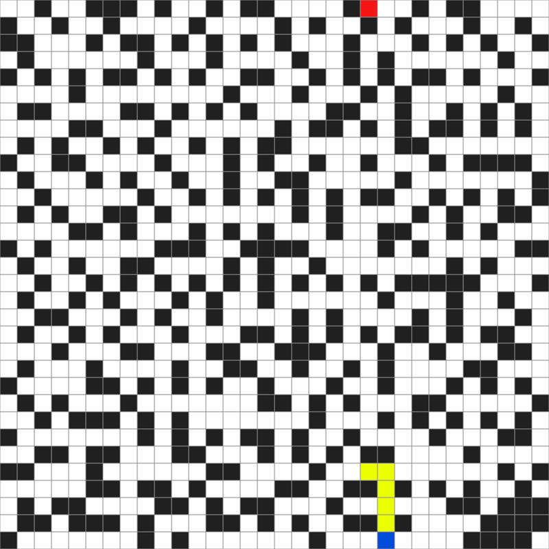

# Maze Solver

This program, written in Python as part of the course [SCC0530 - Artificial Intelligence](https://uspdigital.usp.br/jupiterweb/obterDisciplina?nomdis=&sgldis=SCC0530), implements different graph search algorithms and analyzes them in the context of solving mazes (pathfinding). They are as follows:

  - Depth-First Search (DFS);
  - Breadth-First Search (BFS);
  - Greedy Best-First Search;
  - A* (A-star);
  - Hill Climbing.

The mazes are modeled with undirected unweighted graphs. The ADT was implemented for general use, so its use is not restricted to this program. The mazes can either be provided in a file as an input from the user (check the documentations for more information) or be randomly generated, in which case a variation of the [Prim's algorithm](https://en.wikipedia.org/wiki/Prim%27s_algorithm) is used. A module to generate images representing the mazes is also included. Some of the images of the randomly generated mazes can be seen below. The results, as well as more information regarding the used methodology, can be found in the report (PDF) in this repository (it's written in Portuguese).

To run this program, make sure you have Python 3 installed in your system. Then, run the following commands (or equivalent):

  - pip install numpy
  - pip install pillow
 
Once the dependencies are installed, you can run the program by executing the following in a command shell: 
   - python3 main.py

 
<h3 align="center"><b>Depth-First Search<b></h3>

  
 
 

<h3 align="center"><b>Breadth-First Search<b></h3>

  
 
 

<h3 align="center"><b>Best-First Search<b></h3>

  
 
   
  
<h3 align="center"><b>A*<b></h3>

  

 
  
<h3 align="center"><b>Hill Climbing<b></h3>

  

 

